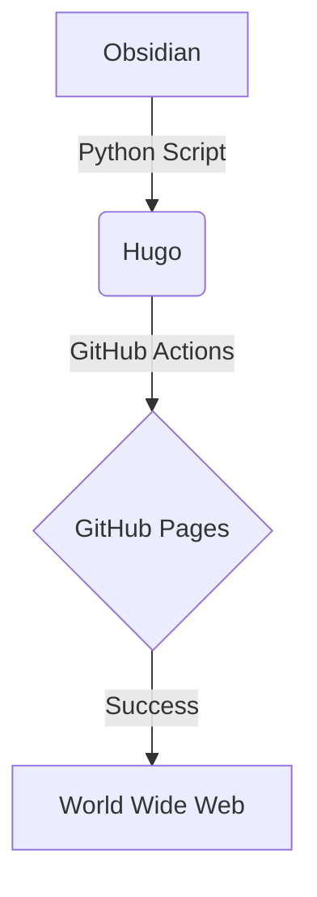

# 1 测试 Latex 公式

行内公式：$e^{i\pi} + 1 = 0$ 应该显示正常。

块级公式：

$$
\int_{-\infty}^{\infty} e^{-x^2} dx = \sqrt{\pi}
$$

# 2 测试 Callouts (Hextra 原生支持)

> [!NOTE]
> 这是一个普通提示。
> 这里的文字应该是蓝色的。

> [!DANGER]
> 警告！
> 这里的文字应该是红色的。

# 3 测试 Mermaid 图表

# 4 其他格式

**加粗**

_斜体_

`行内代码块`

==高亮==

- 无序列表
- 无序列表
- 无序列表

1. 有序列表
2. 有序列表
3. 有序列表

| 表格样式 | 列 1  | 列 2  |
| ---- | ---- | ---- |
| 行 1  | 测试 1 | 测试 3 |
| 行 2  | 测试 2 | 测试 4 |

#publish
